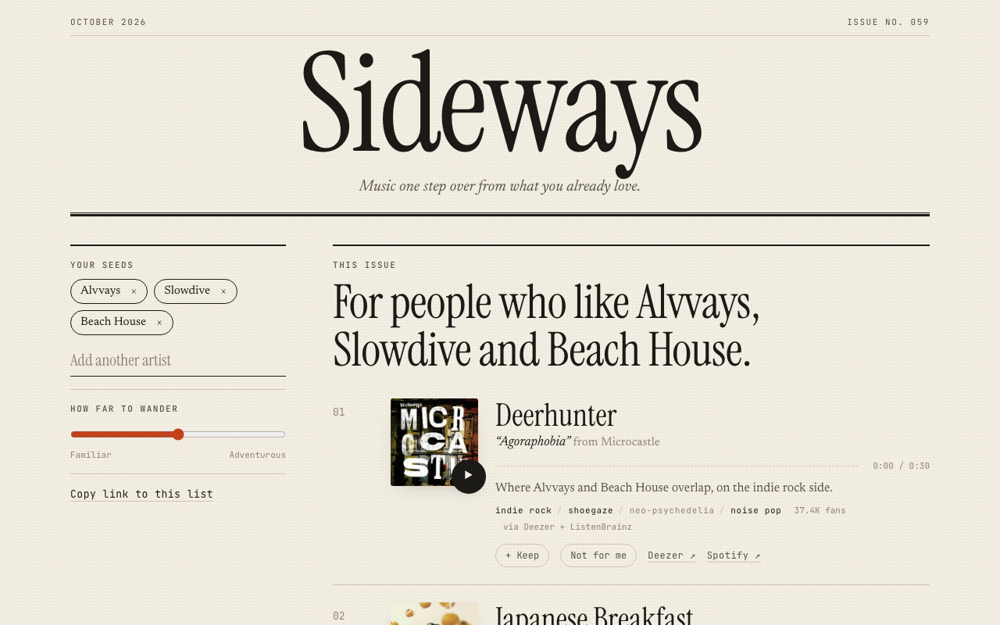

# Sideways



Music recommendations one step sideways from what you already like. Type in a few artists
(or log in with Spotify), get a short ranked list of artists you don't know yet, each with a
30-second preview and a one-line reason.

This is a rebuild of an earlier "Spotify Recommender". That version relied on Spotify's
related-artists, top-tracks, genre and popularity data, all of which Spotify has since removed
for Development Mode apps (Nov 2024 and Mar 2026). Sideways gets similarity from open
sources instead. Details: [`docs/DESIGN.md`](docs/DESIGN.md) and
[`docs/research/2026-10-07-rec-landscape.md`](docs/research/2026-10-07-rec-landscape.md).

## How it works

1. **Neighbors.** For each seed artist: ListenBrainz session-based similar artists (who gets
   played in the same listening sessions) and Deezer related artists. Edges both sources
   agree on get extra weight.
2. **Walk.** Personalized PageRank over that graph, starting from your seeds. Artists you
   keep become extra starting points; artists you skip run a negative walk that is subtracted.
3. **Edit.** A familiar-to-adventurous slider tilts scores by Deezer fan count. MMR re-ranking
   spreads out artists with overlapping MusicBrainz genre tags. Optionally, a free-text request
   ("more upbeat, 90s") re-ranks the top 40 with GLiClass, a local zero-shot classifier that
   scores each candidate's name and genre tags against the request. It only scores artists the
   graph already found, so it can't invent any.
4. **Tracks.** Each pick gets its Deezer top track with a preview.

## Layout

```
api/   FastAPI + recommendation engine (Python 3.14, uv)
web/   React 19 + Vite + TypeScript front end
docs/  design doc and research notes
Dockerfile  one container: builds web/, serves it from the API
```

## Run locally

```bash
# API (port 8000)
cd api && uv sync && uv run sideways

# Web dev server (port 5173, proxies /api to 8000), in another shell
cd web && npm install && npm run dev
```

Open http://127.0.0.1:5173. Use `127.0.0.1`, not `localhost`: the API's CSRF check
allows `http://127.0.0.1:5173` and `http://127.0.0.1:8000` by default.

To run the production build the way the container does: `cd web && npm run build`, then
`cd api && uv run sideways` and open http://127.0.0.1:8000.

Or with Docker:

```bash
docker build -t sideways .
docker run -p 8000:8000 -v sideways-data:/data --env-file .env sideways
```

## Configuration

All optional. Without any of these, the typed-artist flow works fully.

| Variable | Purpose |
|---|---|
| `SPOTIFY_CLIENT_ID`, `SPOTIFY_CLIENT_SECRET`, `SPOTIFY_REDIRECT_URI` | Spotify login (the older `SPOTIPY_*` names also work). Redirect URI is `<origin>/api/spotify/callback`; `/callback` also works for the URI v1 registered. |
| `STEER_MODEL` | Hugging Face model id for the "Steer it" box, e.g. `knowledgator/gliclass-base-v3.0`. Needs `uv sync --extra steer` (torch, ~750 MB model). The Docker image bakes this model in and sets it. |
| `FRONTEND_URL` | Where OAuth returns the browser. `/` in production; `http://127.0.0.1:5173` with the dev server. |
| `ALLOWED_ORIGINS` | Comma-separated origins allowed to POST. The redirect URI's origin is added automatically. |
| `DATA_DIR` | SQLite cache and sessions. Default `./data`. |

Spotify notes: Development Mode apps need the app owner to have Premium, and only allowlisted
accounts (up to 5 for new apps) can log in. Add accounts under the app's **User Management**
in the Spotify dashboard. Everyone else uses typed seeds.

## Tests and evaluation

```bash
cd api && uv run pytest && uv run ruff check src tests scripts
cd web && npm test && npx tsc -b && npx oxlint src

# Leave-one-out recall on real data, per similarity source (slow on a cold cache)
cd api && uv run python scripts/eval_holdout.py
# Pre-fetch the landing page's example seed sets so the demo path is fast
cd api && uv run python scripts/warm_cache.py
```

Leave-one-out result on 2026-10-07 (8 seed sets x 4 artists, top 20, slider at 0.5):

| Similarity source | Held-out artist recovered | Mean rank when recovered |
|---|---|---|
| Deezer only | 20/32 (62%) | 6.8 |
| ListenBrainz only | 22/32 (69%) | 3.8 |
| Both, merged | 26/32 (81%) | 5.2 |

32 trials is a small sample, and recall only shows the graph finds artists you already like,
not that its new picks are good. Steering has only been spot-checked on four requests, not evaluated.

## Known limits

- **Cold requests are slow: about 20-25 s** for seed sets nobody has used before, mostly
  ListenBrainz's similar-artists endpoint (0.6-3.3 s per call, rate limited). Cached
  requests take 1-2 s; similarity is cached for 14 days.
- ListenBrainz similar-artists is a "labs" endpoint with no uptime promise. If it fails,
  results fall back to Deezer only, and the page says so.
- Recommendations are about who listeners pair together, not how tracks sound. Spotify's
  audio features are gone, and there's no audio-content model here.
- Deezer artist matching is by exact name and highest fan count, so homonyms occasionally
  resolve to the wrong artist.

Data: ListenBrainz, MusicBrainz, Deezer. Not affiliated with Spotify or Deezer.
